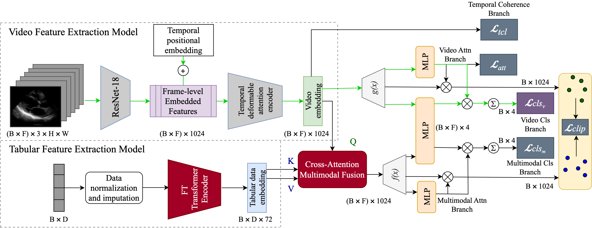
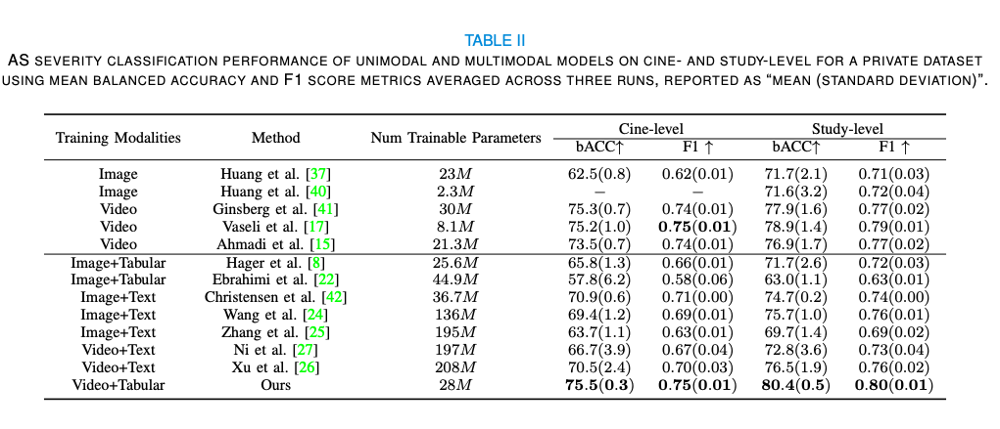

# MultiASNet
This repo holds the code for:
"MultiASNet: Multimodal Label Noise Robust Framework for the Classification of Aortic Stenosis in Echocardiography" in IEEE Transactions in Medical Imaging

This is currently a work in progress and will continuously be updated.

## Introduction

 - We incorporate clinically relevant information from echo reports to guide video-based feature learning, using a transformer-based tabular encoder to extract rich, structured feature representations from report data.
 - We introduce a multimodal integration approach that uses cross-attention to align structured report data features with video features. This method transforms report data into a video-relevant representation by focusing on relevant features in video-report pairs. By addressing noisy and misaligned data, our approach improves CLIP-based alignment between the two modalities.
 - We employ sample selection to avoid overfitting to noisy labels and show that incorporating this method improves performance.
 - We achieve state-of-hte-art study-level balanced accuracy and average F1 scores, outperforming existin methods



## Sections
The main folder contains the code implemented for the private dataset. Implementation for TMED2 dataset is available in folder named tuft. You can get access to TMED2 dataset at https://tmed.cs.tufts.edu/tmed_v2.html. 
### Dataloader
You can add your own dataloader or adjust the implementation of dataloader/as_dataloader.py. Make sure to import your dataloader in train.py.
### Model
The defined models are available in folder named model. The implementation of final model mentioned in the paper is in model/FTC_TAD. There also more choices for model selection and you can choose the model you desire by changing the name of model in get_config.py and add that model in get_model.py.
### Wandb
If you want to enable the wandb log place config['wandb']= True in get_config.py and replace your directory and project name accordingly in train.py.
### Config
All hyperparamteres can be adjusted in get_config.py.
### Training Scheme
The training procedures, loss functions and ... are implemented in network.py.
### Visualization
You can find implementations for different visualizations such as t-SNE, confusion matrix, uncertainty estimation and ... in visualization/vis.py

## Main Results



## Install
### Requirements

* Linux or Windows
  
* Python>=3.7

* (Optional) CUDA>=9.2, GCC>=5.4
  
* PyTorch>=1.5.1, torchvision>=0.6.1 (following instructions [here](https://pytorch.org/))
  
* Other requirements
    ```bash
    pip install -r requirements.txt
    ```
### Running the Code
In order to run the model add your own dataloader in dataloader folder. Chnage the path to dataloader in train.py and run the code below.
```bash
python train.py 
```


## Acknowledgement
The code is includes borrowed implementations from (https://github.com/neda77aa/FTC). Thanks for her great work.

## Citing
```
Will be added
```

## Contact

For questions and suggestions, please contact Victoria Wu at wuvictoria16@gmail.com.
